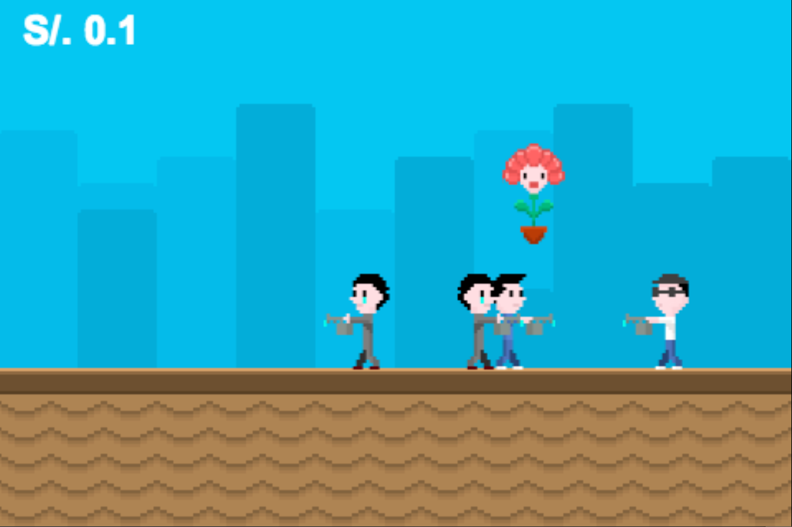

Jumping Flower: 
==============

I created this little game to learn [Quintus game engine](http://html5quintus.com/). The game is simple but I need to make some improvements because it is a little bit slow on iPhone 4 and also there are some problems when I tested it on a Samsung Galaxy II y III.

[Play it](http://joseadrian.github.io/jumping-flower)
========

To do
=====

- Organize code and comment it
- Use the buttons A and B for shooting leafs
- --Let the flower move while on the air--
- Add walk animation to the enemies
- Change *.tmx map for a simple image.
- Make a difference between sprite types. 
- Design the start scene
